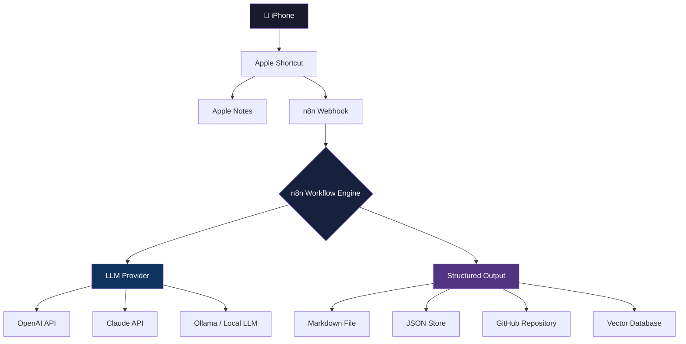

# Thought Pipeline

[](https://opensource.org/licenses/MIT)
[](https://n8n.io)
[](https://support.apple.com/guide/shortcuts/welcome/ios)
[](https://openai.com)
[](https://docs.n8n.io/hosting/)

> A real-time idea ingestion and AI enhancement pipeline powered by iPhone, Apple Shortcuts, n8n, and LLMs.

---

## Overview

Thought Pipeline captures raw ideas the moment they occur — by voice, from anywhere — and transforms them into structured, actionable intelligence using large language models.

Most ideas are lost within seconds. This system eliminates that gap. Speak an idea into your iPhone, and within moments it is captured, routed, enriched by AI, and stored as a structured output ready for review, action, or further exploration.

The pipeline handles the full lifecycle of an idea:

- Capture ideas instantly from anywhere using voice dictation on iPhone
- Route ideas through Apple Shortcuts and Apple Notes into n8n via webhook
- Process and enrich ideas with AI models (cloud or local)
- Generate tags, summaries, action plans, monetization ideas, patent potential, technical feasibility scores, and next steps
- Store structured outputs for future review, search, and analysis

This is not a note-taking app. It is an automation-first idea intelligence platform built for people who think faster than they can type.

---

## Architecture



### Data Flow

```
iPhone → Apple Shortcut → n8n Webhook → AI Processing → Structured Output → Storage
```

1. Voice dictation triggers an Apple Shortcut on the iPhone
2. The shortcut formats the idea and sends it to an n8n webhook endpoint
3. n8n receives the payload and routes it through the processing workflow
4. One or more LLM providers analyze and enrich the raw idea
5. The enriched output is structured as JSON and stored in the configured storage layer

---

## Features

### Capture

- **Voice-based idea capture** — dictate ideas hands-free from anywhere using iPhone
- **Apple Notes integration** — optional backup copy written to Apple Notes automatically
- **Webhook-driven architecture** — any system that can fire an HTTP request can feed this pipeline

### Processing

- **n8n workflow orchestration** — visual, auditable, and fully customizable automation flows
- **AI-powered idea expansion** — raw ideas are transformed into structured multi-field outputs
- **Automatic tagging and categorization** — AI assigns relevant tags without manual input
- **Patent and business opportunity scoring** — numeric scores for monetization potential and novelty
- **Technical feasibility assessment** — LLM evaluates build complexity and required stack

### Output

- **Markdown export support** — every idea generates a clean, readable markdown document
- **GitHub integration** — structured outputs can be committed directly to a repository
- **JSON structured storage** — machine-readable output ready for downstream automation

### Extensibility

- **Local AI model compatibility** — works with Ollama and other locally hosted models
- **Cloud AI compatibility** — supports OpenAI, Anthropic, and any OpenAI-compatible API
- **Future vector database support** — architecture designed for semantic search and RAG workflows
- **Automation-friendly design** — outputs are structured for ingestion by other tools and agents

---

## Example Use Cases

| Category | Example |
|---|---|
| Product ideas | Capture a SaaS concept while driving and receive a full product brief |
| Patent brainstorming | Score an invention idea for novelty and generate prior art search queries |
| Business concepts | Turn a shower thought into a business model outline |
| DIY project planning | Dictate a build idea and receive a materials list and build sequence |
| Research capture | Log a research question and get a structured investigation outline |
| Technical architecture | Describe a system and receive a component diagram outline and tech stack suggestion |
| Content and podcast ideas | Capture episode concepts with talking points generated automatically |
| Social media topics | Convert a raw observation into platform-specific content angles |

---

## Planned AI Enhancements

The following capabilities are on the active roadmap:

- **Multi-agent analysis** — route ideas through specialized agents (technical, business, creative) in parallel
- **Competitive market research** — automated web research triggered by idea keywords
- **Automated GitHub repo scaffolding** — generate and push a starter repository from an idea automatically
- **Automatic task generation** — decompose ideas into trackable tasks in project management tools
- **AI-generated implementation plans** — step-by-step execution plans produced at capture time
- **Idea ranking system** — score and surface the highest-potential ideas on a regular cadence
- **Knowledge graph support** — link related ideas across the archive and surface connections
- **Semantic search** — query the idea archive using natural language rather than exact keywords
- **Personal RAG integration** — ground LLM responses in your own historical idea archive

---

## Tech Stack

| Component | Purpose |
|---|---|
| Apple Shortcuts | Voice capture and webhook trigger on iPhone |
| Apple Notes | Optional local backup of raw idea text |
| n8n | Workflow orchestration and routing engine |
| OpenAI API | Cloud LLM provider (GPT-4o and variants) |
| Claude API | Cloud LLM provider (Anthropic Claude) |
| Ollama | Local LLM runtime for self-hosted inference |
| Local LLMs | Privacy-preserving on-device or on-prem AI |
| Webhooks | Transport layer between iPhone and n8n |
| JSON | Structured output format for all processed ideas |
| Markdown | Human-readable output format for idea documents |
| GitHub Actions | CI/CD and optional automated commit workflows |

---

## Installation

### Prerequisites

- n8n instance (self-hosted or cloud)
- iPhone with Shortcuts app
- At least one LLM provider (OpenAI, Anthropic, or Ollama)

### 1. Deploy n8n

Self-hosted via Docker:

```bash
docker run -it --rm \
  --name n8n \
  -p 5678:5678 \
  -v ~/.n8n:/home/node/.n8n \
  n8nio/n8n
```

Or use [n8n Cloud](https://n8n.io/cloud/) for a managed instance.

### 2. Create the Webhook in n8n

1. Create a new workflow in n8n
2. Add a **Webhook** node as the trigger
3. Set the HTTP method to `POST`
4. Copy the generated webhook URL
5. Set authentication (Header Auth recommended — see [Security](#security-considerations))

### 3. Configure Environment Variables

Create a `.env` file or configure credentials directly in n8n:

```env
OPENAI_API_KEY=sk-...
ANTHROPIC_API_KEY=sk-ant-...
OLLAMA_BASE_URL=http://localhost:11434
WEBHOOK_SECRET=your-secret-token
OUTPUT_DIR=./output
GITHUB_TOKEN=ghp_...
```

### 4. Set Up iPhone Shortcut

1. Open the **Shortcuts** app on your iPhone
2. Create a new shortcut
3. Add a **Dictate Text** action
4. Add a **Get Contents of URL** action configured as:
   - URL: your n8n webhook URL
   - Method: `POST`
   - Headers: `Content-Type: application/json`, `X-Webhook-Secret: your-secret-token`
   - Body (JSON):
     ```json
     {
       "raw_idea": "[Dictated Text]",
       "timestamp": "[Current Date]",
       "source": "iphone-shortcut"
     }
     ```
5. Add the shortcut to your home screen or Back Tap for instant access

### 5. Import the n8n Workflow

Import the workflow JSON from the `/workflows` directory into your n8n instance. Configure the LLM credentials in the AI nodes.

---

## Example Workflow

The following illustrates a complete end-to-end idea capture:

1. **User dictates idea** — "What if there was a subscription service that mailed you locally sourced ingredients for traditional recipes from a different country every month, with a short documentary about the region included."

2. **Shortcut fires webhook** — The Shortcut formats the text as a JSON payload and sends a POST request to the n8n webhook endpoint.

3. **n8n processes the payload** — The workflow validates the payload, enriches metadata, and routes it to the configured LLM node.

4. **LLM enhances the thought** — The model analyzes the idea and generates a structured multi-field response covering summary, tags, monetization, patent potential, technical feasibility, and next steps.

5. **Structured result is saved** — The enriched output is written to the storage layer as both JSON and Markdown. Optionally committed to a GitHub repository.

---

## Example JSON Payload

Input payload sent from the iPhone Shortcut:

```json
{
  "raw_idea": "A subscription box that sends locally sourced ingredients for traditional regional recipes from a different country every month, paired with a short documentary about the region.",
  "timestamp": "2026-05-07T09:14:32Z",
  "source": "iphone-shortcut"
}
```

Enriched output returned by the pipeline:

```json
{
  "id": "idea-20260507-091432",
  "raw_idea": "A subscription box that sends locally sourced ingredients for traditional regional recipes from a different country every month, paired with a short documentary about the region.",
  "timestamp": "2026-05-07T09:14:32Z",
  "source": "iphone-shortcut",
  "tags": [
    "subscription-box",
    "food",
    "cultural-education",
    "e-commerce",
    "content-media",
    "international"
  ],
  "ai_summary": "A monthly subscription service combining curated regional cooking ingredients with paired short-form documentary content. Targets food enthusiasts and culturally curious consumers. Differentiates through authenticity of sourcing and educational media component.",
  "monetization_score": 8.2,
  "patent_potential": 3.1,
  "technical_feasibility": 9.0,
  "market_size_estimate": "Large — adjacent to $32B meal kit market with media differentiation angle",
  "competitive_landscape": "HelloFresh, Goldbelly, Universal Yums — none with integrated documentary component",
  "next_steps": [
    "Research existing subscription box competitors in the cultural food space",
    "Identify 3 potential regional supplier networks to pilot",
    "Outline documentary production model (licensed vs. original content)",
    "Draft a landing page concept to validate demand before building",
    "Estimate per-box COGS and target margin at $45/month price point"
  ],
  "action_plan": {
    "week_1": "Market research and competitor analysis",
    "week_2": "Supplier outreach and unit economics model",
    "month_1": "Landing page and waitlist launch",
    "month_3": "Pilot with 50 subscribers and one origin country"
  }
}
```

---

## Roadmap

| Phase | Status | Description |
|---|---|---|
| MVP | In Progress | Voice capture, webhook, n8n flow, LLM enrichment, JSON output |
| AI Enrichment | Planned | Multi-field scoring, tagging, action plans, feasibility analysis |
| GitHub Integration | Planned | Auto-commit structured outputs to a dedicated ideas repository |
| Local Model Support | Planned | Full Ollama integration for privacy-first offline processing |
| Dashboard UI | Planned | Web interface for browsing, filtering, and reviewing captured ideas |
| Mobile App | Future | Native app replacing the Shortcuts dependency |
| Vector Database Memory | Future | Semantic search across the full idea archive via embedding store |
| Multi-User Support | Future | Team-based idea capture with shared pipelines and access controls |

---

## Security Considerations

### Local-First Architecture

The pipeline is designed to run entirely on infrastructure you control. n8n can be self-hosted, LLMs can run locally via Ollama, and outputs can be stored on local or private cloud storage. No third-party service is required.

### API Key Protection

- Store all API keys as environment variables or in n8n's encrypted credential store
- Never hardcode credentials in workflow JSON exports before sharing
- Rotate keys on a regular schedule
- Use scoped API keys with the minimum permissions required

### Webhook Security

- Enable webhook authentication using a shared secret passed via request header
- Validate the secret in the first n8n node before processing any payload
- Restrict the webhook endpoint to known source IP ranges where possible
- Use HTTPS for all webhook traffic — never expose a plaintext HTTP endpoint

### Self-Hosted Options

- n8n: fully self-hostable via Docker or a dedicated VM
- Ollama: runs locally on macOS, Linux, or Windows with no external calls
- Storage: local filesystem, NAS, or private S3-compatible object store

### Privacy Considerations

Ideas captured through this pipeline may be highly sensitive — business concepts, inventions, personal insights. If using cloud LLM providers (OpenAI, Anthropic), review their data retention and training policies. For maximum privacy, run the entire pipeline locally using a self-hosted n8n instance and Ollama with a capable local model.

---

## Contributing

Contributions are welcome. This project is in active development and the core architecture is still evolving.

### How to Contribute

1. Fork the repository
2. Create a feature branch from `main`:
   ```bash
   git checkout -b feature/your-feature-name
   ```
3. Make your changes with clear, focused commits
4. Open a pull request against `main` with a description of what the change does and why

### Contribution Guidelines

- Keep pull requests focused. One feature or fix per PR.
- Include a brief description of the problem being solved
- If adding a new n8n workflow, export it as JSON and place it in the `/workflows` directory
- If adding a new LLM provider integration, document the required credentials and any configuration steps
- Do not commit API keys, webhook secrets, or other credentials under any circumstances

### Reporting Issues

Use GitHub Issues to report bugs, request features, or ask questions. Include:

- A clear description of the issue
- Steps to reproduce (for bugs)
- Your n8n version and deployment method
- Any relevant workflow or payload examples (sanitize credentials before posting)

---

## License

This project is licensed under the [MIT License](LICENSE).

---

## Topics

```
automation n8n apple-shortcuts apple-notes llm ai workflow-automation idea-management productivity self-hosted ollama openai claude markdown webhooks
```
